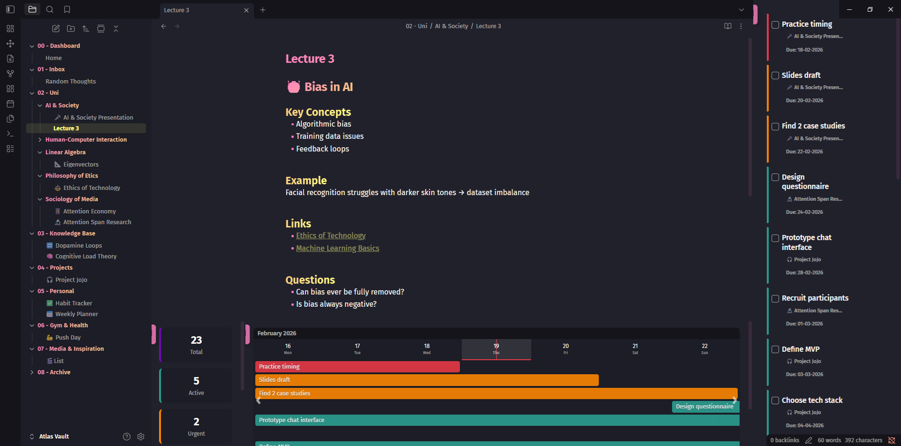
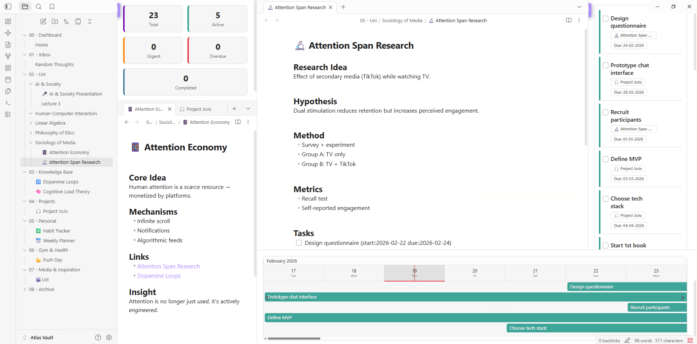
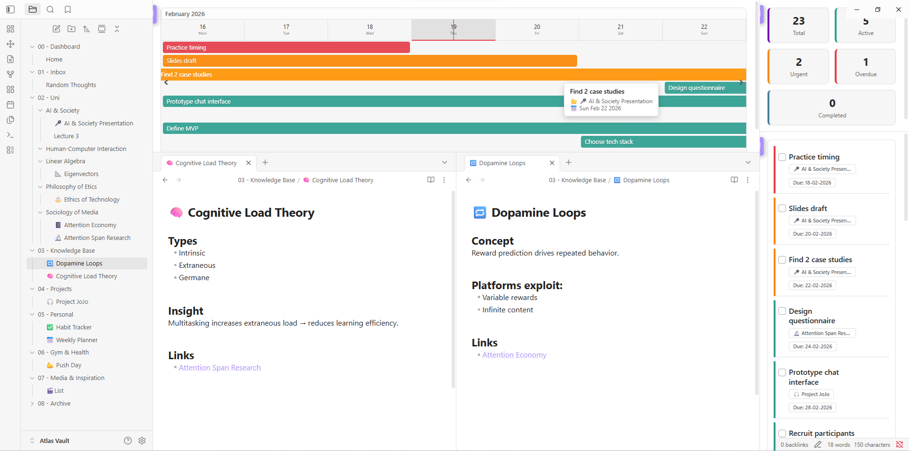
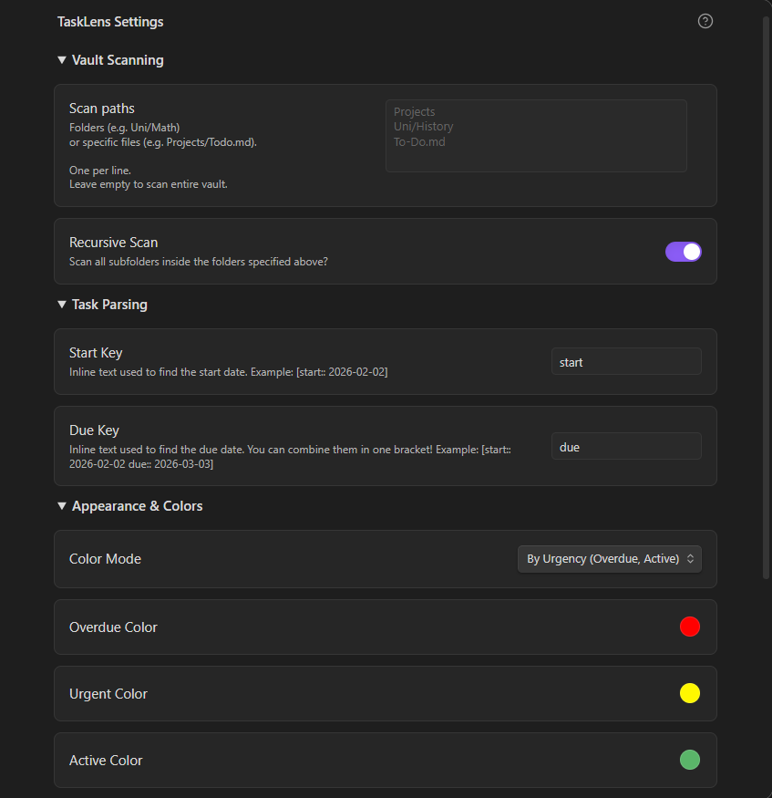

# TaskLens for Obsidian

TaskLens is a native, widget-based dashboard that turns Obsidian into a powerful task command center. Visualize deadlines, manage tasks, and track project progress without leaving your vault or changing how you write.



## Key Features

- **The Dashboard:** A unified, customizable workspace view combining an interactive Timeline, Task List, and Statistics
- **Smart Timeline:** Tasks dynamically span multiple days from start to finish. Features a sticky month header, vertical month dividers, hover tooltips, and click-to-open behavior
- **Dynamic Topic Colors:** Assign unique colors to different projects or folders. TaskLens automatically color-codes your entire dashboard based on your custom palette
- **Focus Mode:** Instantly hide all TaskLens widgets and collapse your sidebars to focus purely on writing. Click again to restore your exact window layout perfectly
- **Quick Add:** A unified ribbon menu allows you to inject a new task directly at your current text cursor, or append it to any specific file in your vault

## Task Format

TaskLens uses standard markdown checkboxes. It scans for inline dates, supporting both `YYYY-MM-DD` and `DD-MM-YYYY` formats. You can customize the `start` and `due` keys in the settings.

```markdown
- [ ] Read Chapter 4 [due:: 2024-05-15]
- [ ] Submit assignment [start:: 10-05-2024 due:: 15-05-2024]
- [ ] Call mom 📅 2024-05-20
```

## Usage

TaskLens operates entirely from a single, unified Ribbon Icon (the magnifying glass checkmark):

1. **Open Dashboard:** Spawns the main widgets (splits intelligently so it doesn't overwrite your active note)
2. **Quick Add Task:** Opens the quick-entry modal
3. **Lock/Unlock Layout:** Toggle this to drag and drop widgets around your screen. Lock it to hide the tabs for a clean look. **Customize and place the windows however you like and whatever size!**
4. **Enter Focus Mode:** Temporarily hides all widgets so you can write

Create your own version of the TaskLens dashboard by each widget to your liking.

## Gallery

<details> 
    <summary> 📸 Open Gallery / See White Theme </summary>
    <br>
 <p align="center">
  <br>
  <em>Layout Variant</em> </p>
 <br>
    <p align="center">
    <br>
    <em>Alternative Layout Variation</em> </p>
 <br>
    <p align="center">
    <br>
    <em>TaskLens Settings Preview</em>
</p>
</details>


## *Demo Video*
<p align="center">
  <a href="https://youtu.be/WHJTi8GESqQ">
    
  </a>
</p>


## Installation

### Manual Installation

1. Go to the [Releases](https://github.com/nightaqua/tasklens/releases) page of this repository
2. Download `main.js`, `manifest.json`, and `styles.css` from the latest release
3. Place them in your vault's plugins folder: `YourVault/.obsidian/plugins/tasklens/`
4. Restart Obsidian and enable TaskLens in Community Plugins

Want to know more? Check out [Contributing](docs/06-Contributing.md) for more information on about the development process.

## Support

If you enjoy TaskLens and it helps you stay organized, consider supporting its development!

<p align="center">
  <a href="https://buymeacoffee.com/">
    
  </a>
</p>