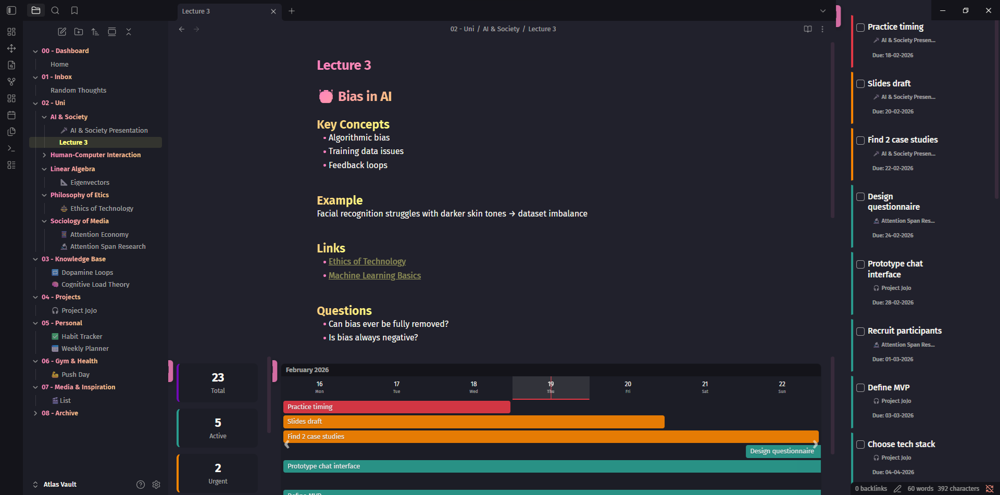
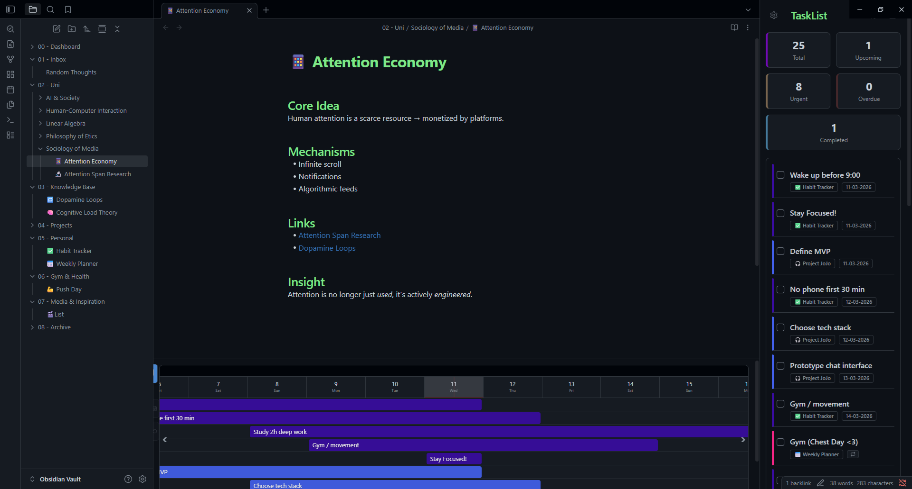
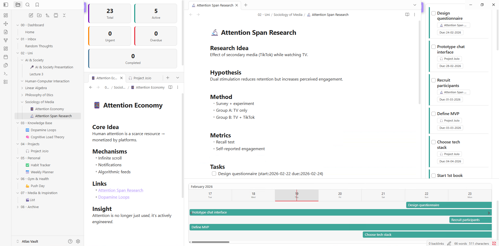
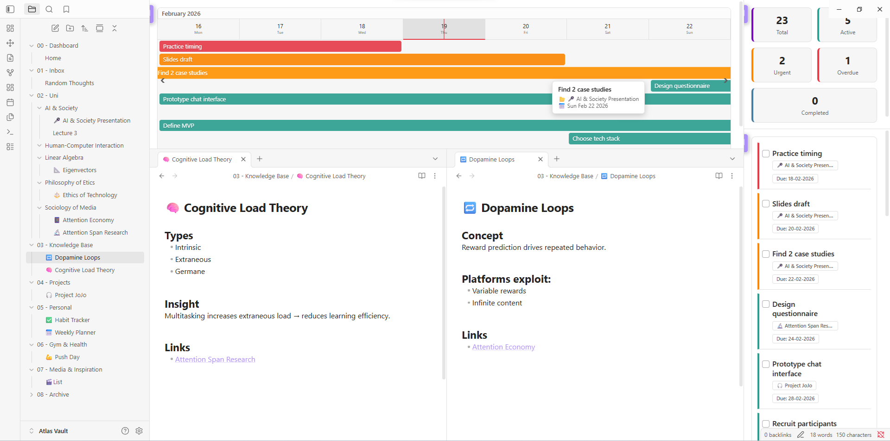
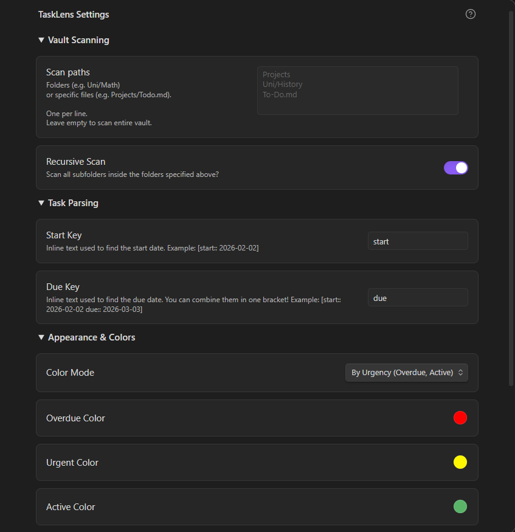

# TaskLens for Obsidian

TaskLens is a native, widget-based dashboard that turns Obsidian into a powerful task command center. Visualize deadlines, manage tasks, and track project progress without leaving your vault or changing how you write.



## Key Features

- **The Dashboard:** A unified, customizable workspace combining an interactive Timeline, Task List, Kanban Board, and Statistics — all in one view
- **Smart Timeline:** Tasks dynamically span multiple days from start to finish. Features a sticky month header, vertical month dividers, rich hover tooltips, and click-to-open behavior
- **Kanban Board View:** Group tasks into status columns (Active, Upcoming, Urgent, Overdue, Completed). Drag cards between columns to reschedule tasks — changes are written straight back to your Markdown files
- **Task Actions:** Inline edit and delete buttons on each task card let you update any task without leaving the dashboard. Enable them in Settings
- **Dynamic Topic Colors:** Assign unique colors to different projects or folders. TaskLens automatically color-codes your entire dashboard based on your custom palette
- **Focus Mode:** Instantly hide all TaskLens widgets and collapse your sidebars to focus purely on writing. Click again to restore your exact window layout perfectly
- **Quick Add & Edit:** The Quick Add modal lets you inject a new task at the cursor or into any file in your vault — with start date, due date, and a recurrence dropdown. The same modal opens pre-populated when editing an existing task

## Task Format

TaskLens uses standard markdown checkboxes. It scans for inline dates, supporting both `YYYY-MM-DD` and `DD-MM-YYYY` formats. You can customize the `start` and `due` keys in settings.

```markdown
- [ ] Read Chapter 4 (due:: 2024-05-15)
- [ ] Submit assignment [start:: 10-05-2024 due:: 15-05-2024]
- [ ] Call mom 📅 2024-05-20
- [ ] Write intro [due:: 2024-05-20] [notes:: Check outline from last week]
```

Optional `[notes:: ...]` metadata appears beneath the task in the list view.

## Usage

TaskLens operates entirely from a single, unified Ribbon Icon (the magnifying glass checkmark):

1. **Open Dashboard:** Spawns the main widgets (splits intelligently so it doesn't overwrite your active note)
2. **Quick Add Task:** Opens the quick-entry modal
3. **Lock/Unlock Layout:** Toggle this to drag and drop widgets around your screen. Lock it to hide the tabs for a clean look. **Customize and place the windows however you like and whatever size!**
4. **Enter Focus Mode:** Temporarily hides all widgets so you can write

Create your own version of the TaskLens dashboard by customizing each widget to your liking.

## Gallery




<details> 
    <summary> 📸 Open Gallery / See More </summary>
    <br>
 <p align="center">
  <br>
  <em>Layout Variant</em> </p>
 <br>
    <p align="center">
    <br>
    <em>Alternative Layout Variation</em> </p>
 <br>
    <p align="center">
    <br>
    <em>TaskLens Settings Preview</em>
</p>
</details>

## *Demo Video*
<p align="center">
  <a href="https://youtu.be/WHJTi8GESqQ">
    
  </a>
</p>

## Installation

### Install from the Community Plugins Browser

1. Open Obsidian and go to Settings → Community plugins
2. Click **Browse**, then search for "TaskLens"
3. Click **Install**, then **Enable**

### Manual Installation

1. Go to the [Releases](https://github.com/nightaqua/tasklens/releases) page of this repository
2. Download `main.js`, `manifest.json`, and `styles.css` from the latest release
3. Place them in your vault's plugins folder: `YourVault/.obsidian/plugins/tasklens/`
4. Restart Obsidian and enable TaskLens in Community Plugins

Want to know more? Check out [Contributing](docs/06-Contributing.md) for more information on about the development process.

## Support

If you enjoy TaskLens and it helps you stay organized, consider supporting its development!

<p align="center">
  <a href="https://buymeacoffee.com/JoblessDev">
    
  </a>
</p>
